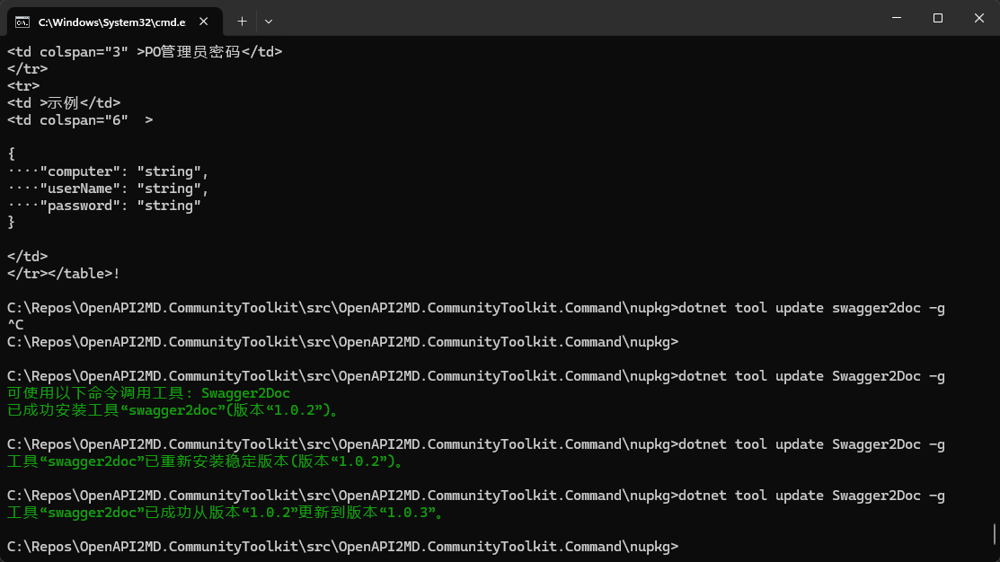
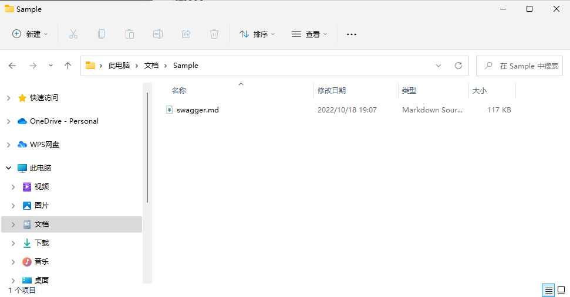
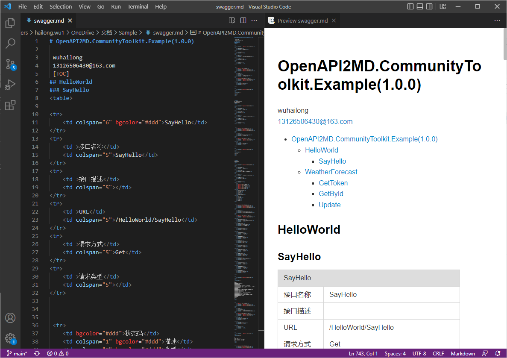

## 感谢JetBrains 支持


[OpenSourceSupport](https://jb.gg/OpenSourceSupport)

# swagger2md

假如你编写了一个基于OpenAPI3.0规范 的WebAPI现在正想着如何编写文档以便于他人更方便调用它，那么swagger2md可以帮助你

## 功能特性

- 将swagger.json生成markdown文档
- 请求参数example展示
- 请求body json格式化
- 返回response json格式化
- 大纲展示
- 接口summary展示
- 接口remark展示
- 接口参数字段展示
- 接口reponse 字段展示

## 软件架构(可选)

.NET 6

## 快速开始
open OpenAPI2MD.CommunityToolkit.sln with vs

### 依赖检查
dotnet restore
<!-- 描述该项目的依赖，比如依赖的包、工具或者其他任何依赖项 -->

### 构建
dotnet build
<!-- 描述如何构建该项目 -->

### 运行
dotnet run
<!-- 描述如何运行该项目 -->

## 使用指南
- 安装msi

    双击运行[Swagger2Md.msi](https://gitee.com/galacode/OpenAPI2MD.CommunityToolkit/releases/tag/7.5.0)

- 安装2

    ``` cs
    dotnet tool install --global Swagger2Doc
    ```

- 升级

    ``` cs
    dotnet tool update Swagger2Doc -g [--version 1.0.3]
    ```

    
- 卸载

    ``` cs
    dotnet tool uninstall Swagger2Doc
    ```


- 调用

    在目录中打开cmd窗口运行命令

    ```
    swagger2doc -t md -s http://localhost:18100/swagger/3.0.0/swagger.json
    ```

- Swagger2Md + swagger.json 的 url

    

- 查看


    打开swagger.json

    
<!-- 描述如何使用该项目 -->

## 如何贡献
star -> fork -> pull request
<!-- 告诉其他开发者如果给该项目贡献源码 -->


## 关于作者
name:master never down
email:13126506430@1163.com
<!-- 这里写上项目作者 -->

## 谁在用(可选)
maybe next is you
<!-- 可以列出使用本项目的其他有影响力的项目，算是给项目打个广告吧 -->

## 许可证
[MIT](https://gitee.com/galacode/OpenAPI2MD.CommunityToolkit/blob/main/LICENSE)
<!-- 这里链接上该项目的开源许可证 -->